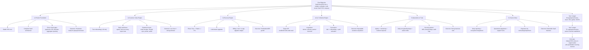

# SanoPOS SaaS Growth Diagram

```mermaid
flowchart TD
    A["Final Objective<br/>Build SanoPOS into a reliable, profitable, multi-tenant SaaS POS company"]

    A --> B["1) Product Foundation"]
    A --> C["2) Customer Value Engine"]
    A --> D["3) Revenue Engine"]
    A --> E["4) Go-To-Market Engine"]
    A --> F["5) Operations & Trust"]
    A --> G["6) Scale & Moat"]

    B --> B1["Stable POS core"]
    B --> B2["Complete SaaS architecture"]
    B --> B3["Close critical gaps:<br/>payments, 2FA, backups, aggregate reporting"]
    B --> B4["Outcome: Production-ready for paying businesses"]

    C --> C1["Fast onboarding (<10 min)"]
    C --> C2["Daily usefulness:<br/>speed, stock accuracy, report trust"]
    C --> C3["Retention hooks:<br/>email receipts, Shopify sync, printer, audits"]
    C --> C4["Outcome: Low churn + strong referrals"]

    D --> D1["Plans: Free -> Starter -> Pro"]
    D --> D2["Limit-based upgrades"]
    D --> D3["Billing + trial + in-app upgrade nudges"]
    D --> D4["Outcome: Predictable MRR growth"]

    E --> E1["Target ICP:<br/>small/mid multi-outlet retail"]
    E --> E2["Acquisition:<br/>demos, referrals, partner channels"]
    E --> E3["Conversion:<br/>trial -> onboarding -> paid activation"]
    E --> E4["Outcome: Repeatable customer acquisition"]

    F --> F1["Uptime + monitoring + incident response"]
    F --> F2["Daily encrypted backups + restore drills"]
    F --> F3["Security posture:<br/>MFA, least privilege, audit logs"]
    F --> F4["Outcome: Strong business trust"]

    G --> G1["Deep reporting + ecosystem integrations"]
    G --> G2["Operational playbooks + support SLAs"]
    G --> G3["Expansion by vertical/region/partners"]
    G --> G4["Outcome: Defensible SaaS business"]

    H["Year 1 target:<br/>20 paying businesses,<br/>churn <5%, uptime >99.5%"]
    I["Year 2 target:<br/>75+ paying businesses,<br/>partner channel established"]
    J["End state:<br/>Default POS choice in target market<br/>with predictable recurring revenue"]

    A --> H
    H --> I
    I --> J
```

