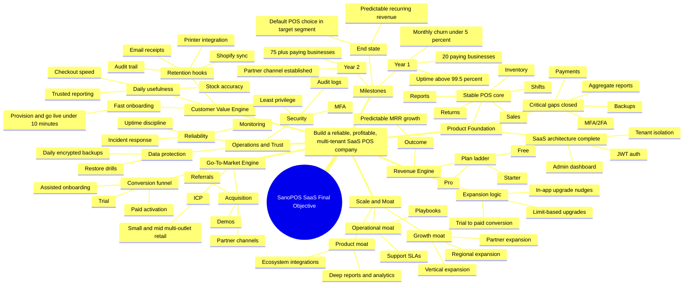

# SanoPOS SaaS Growth Mindmap

```mermaid
mindmap
  root((SanoPOS SaaS Final Objective))
    Build a reliable, profitable, multi-tenant SaaS POS company
      Product Foundation
        Stable POS core
          Sales
          Returns
          Shifts
          Inventory
          Reports
        SaaS architecture complete
          Tenant isolation
          JWT auth
          Admin dashboard
        Critical gaps closed
          Payments
          MFA/2FA
          Backups
          Aggregate reports
      Customer Value Engine
        Fast onboarding
          Provision and go live under 10 minutes
        Daily usefulness
          Checkout speed
          Stock accuracy
          Trusted reporting
        Retention hooks
          Email receipts
          Shopify sync
          Printer integration
          Audit trail
      Revenue Engine
        Plan ladder
          Free
          Starter
          Pro
        Expansion logic
          Limit-based upgrades
          Trial to paid conversion
          In-app upgrade nudges
        Outcome
          Predictable MRR growth
      Go-To-Market Engine
        ICP
          Small and mid multi-outlet retail
        Acquisition
          Demos
          Referrals
          Partner channels
        Conversion funnel
          Trial
          Assisted onboarding
          Paid activation
      Operations and Trust
        Reliability
          Monitoring
          Incident response
          Uptime discipline
        Data protection
          Daily encrypted backups
          Restore drills
        Security
          Least privilege
          MFA
          Audit logs
      Scale and Moat
        Product moat
          Deep reports and analytics
          Ecosystem integrations
        Operational moat
          Playbooks
          Support SLAs
        Growth moat
          Vertical expansion
          Regional expansion
          Partner expansion
      Milestones
        Year 1
          20 paying businesses
          Monthly churn under 5 percent
          Uptime above 99.5 percent
        Year 2
          75 plus paying businesses
          Partner channel established
        End state
          Default POS choice in target segment
          Predictable recurring revenue
```

